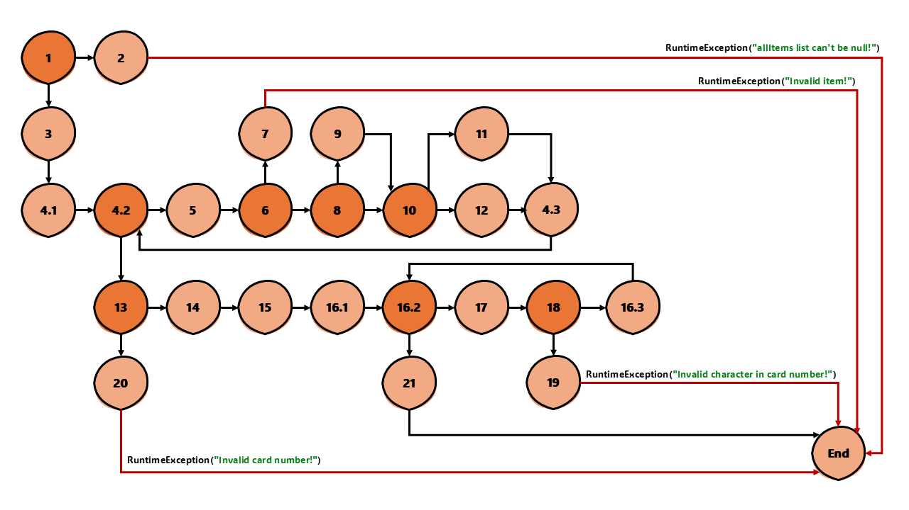

# Втора лабораториска вежба по Софтверско инженерство

## Стефанија Трајкоска, бр. на индекс 236048

###  Control Flow Graph



### Цикломатска комплексност

Цикломатската комплексност на овој код е 9, истата ја добив преку формулата P+1, каде што P е бројот на предикатни јазли. Во случајoв P=8, па цикломатската комплексност изнесува 9. Исто така цикломатската комплексност е еднаква на бројот на региони, а на сликата можеме да видиме 9 региони.

### Тест случаи според критериумот  Every statement 
```java
    public class SILab2NewTests {
        @Test
        void EveryStatementMinimalAlternative() {
            // Test 1: Null item листа
            assertThrows(RuntimeException.class, () -> SILab2.checkCart(null, "4444333322221111"));
            System.out.println("Test 1 passed - null item list");
    
            // Test 2: Item без име
            List<Item> items2 = List.of(new Item("", 2, 150, 0));
            assertThrows(RuntimeException.class, () -> SILab2.checkCart(items2, "4444333322221111"));
            System.out.println("Test 2 passed - item with empty name");
    
            // Test 3: Valid item: со price>300, discount>0, quantity>10 и валидна картичка
            List<Item> items3 = List.of(new Item("Bread", 12, 100, 0.2));
            //од делот else sum += item.getPrice()*item.getQuantity();
            double expected3 = (100 * 12) - 30; 
            assertEquals(expected3, SILab2.checkCart(items3, "9876543210987654"), 0.001);
            System.out.println("Test 3 passed - only quantity > 10");
	    
            // Test 4: Valid item: со price>300, discount>0, quantity>10 но со невалидна картичка
            List<Item> items = List.of(new Item("Water", 1, 100, 0));
            RuntimeException thrown = assertThrows(RuntimeException.class,() -> SILab2.checkCart(items, null));
            assertTrue(thrown.getMessage().contains("Invalid card number"));
     	    System.out.println("Test 4 passed - card number is null");
	    
            // Test 5: Valid item: со price>300, discount>0, quantity>10 и картичка со невалиден симбол
            List<Item> items4 = List.of(new Item("Juice", 1, 200, 0));
            assertThrows(RuntimeException.class, () -> SILab2.checkCart(items4, "12345678901234X7"));
            System.out.println("Test 5 passed - invalid char in card number");
        }
    }
```
### Тест случаи според критериумот Every path
```java
    public class SILab2NewTests {
        @Test
        void MultipleCondition() {
            // TC1: TXX (само price > 300)
            List<Item> tff = List.of(new Item("Bread", 3, 400, 0));
            assertEquals(400*3 - 30, SILab2.checkCart(tff, "1111222233334444"), 0.001);
            System.out.println("TXX test successful");
        
            // TC2: FTX (само discount > 0)
            List<Item> ftf = List.of(new Item("Milk", 6, 150, 0.2));
            assertEquals(150*0.8*6 - 30, SILab2.checkCart(ftf, "5555666677778888"), 0.001);
            System.out.println("FTX test successful");
        
            // TC3: FFT (само quantity > 10)
            List<Item> fft = List.of(new Item("Eggs", 20, 10, 0));
            assertEquals(10*20 - 30, SILab2.checkCart(fft, "9999000011112222"), 0.001);
            System.out.println("FFT test successful");
        
            // TC4: FFF (сите false)
            List<Item> fff = List.of(new Item("Butter", 2, 50, 0));
            assertEquals(50*2, SILab2.checkCart(fff, "3333444455556666"), 0.001);
            System.out.println("FFF test successful");
        }
    } 
```
### Објаснување на напишаните unit tests
1. <b>Тестови според Every statement:</b><br>
	Овие тестови обезбедуваат дека секоја линија од кодот ќе биде извршена барем еднаш:
    - <b>Тест 1.</b> Проверува дали методот правилно фрла RuntimeException кога листата на производи е null.
    - <b>Тест 2.</b> Проверува дали се фрла RuntimeException кога производ има празен стринг за име.
	- <b>Тест 3.</b> Проверува исправна пресметка на вкупна цена за производ со количина поголема од 10, попуст, и валиден број на картичка – овој тест го активира блокот каде што се пресметува попустот и се одзема вредноста од 30.
	- <b>Тест 4.</b> Проверува дали методот правилно фаќа грешка при невалиден број на картичка (воопшто да не постои или да не е 16 цифри).
	- <b>Тест 5.</b> Проверува дали методот правилно фаќа грешка при невалиден број на картичка кој содржи недозволени карактери (во случајов 'X')
	Овие тестови гарантираат дека секој дел од кодот е опфатен и извршен.
2. <b> Тестови според Multiple condition: </b><br>
	Овие тестови го покриваат логичкиот израз: ```if (item.getPrice() > 300 || item.getDiscount() > 0 || item.getQuantity() > 10)```. Ова е логичка проверка со три услови поврзани со "ИЛИ", и затоа треба да се тестираат најмалку четири комбинации:
	- <b>TXX</b> (само price > 300) – тестира ситуација каде што цената го исполнува условот, па попустот и количината нема да бидат ни проверени.
	- <b>FTX</b> (само discount > 0) – проверува дали попустот го задоволува условот, ако цената не го задоволува, а количината нема ни да се провери.
	- <b>FFT</b> (само quantity > 10) – проверува дали количината го исполнува условот, ако не го исполнуваат цената и попустот.
	- <b>FFF</b> (сите услови false) – проверка кога ниту еден услов не е исполнет.