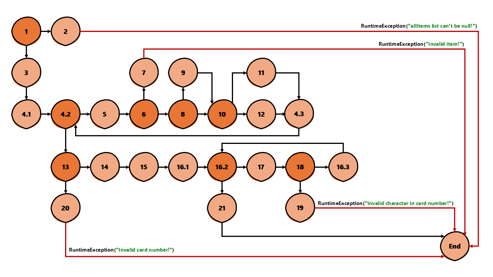

# Стефанија Трајкоска 236048

2. CFG


3. Цикломатска комплексност на граф<br>
Цикломатската комплексност на овој граф е 9 (8 пред. јазли +1)(исто така има 9 региони)

4. Сите тест случаи според Every Statement критериумот<br>
Ова значи дека треба да напишеме тест примери после кои секоја линија код во фунцкијата ќе биде извршена
    ```java
    public class SILab2NewTests {
        @Test
        void EveryStatementMinimalAlternative() {
            // Test 1: Null item листа
            assertThrows(RuntimeException.class, () -> SILab2.checkCart(null, "4444333322221111"));
            System.out.println("Test 1 passed - null item list");
    
            // Test 2: Item без име
            List<Item> items2 = List.of(new Item("", 2, 150, 0));
            assertThrows(RuntimeException.class, () -> SILab2.checkCart(items2, "4444333322221111"));
            System.out.println("Test 2 passed - item with empty name");
    
            // Test 3: Valid item: со price>300, discount>0, quantity>10 и валидна картичка
            List<Item> items3 = List.of(new Item("Bread", 12, 100, 0.2));
            //од делот else sum += item.getPrice()*item.getQuantity();
            double expected3 = (100 * 12) - 30; 
            assertEquals(expected3, SILab2.checkCart(items3, "9876543210987654"), 0.001);
            System.out.println("Test 3 passed - only quantity > 10");
    
            // Test 4: Карта со невалиден симбол, пример: буква 'X'
            List<Item> items4 = List.of(new Item("Juice", 1, 200, 0));
            assertThrows(RuntimeException.class, () -> SILab2.checkCart(items4, "12345678901234X7"));
            System.out.println("Test 4 passed - invalid char in card number");
        }
    }
    ```
    Потребни се 4 тестови: еден за празна низа со артикли, еден за артикл без име во листата со предмети, еден кој ги поминува сите услови и има валиден број на картичка и еден за неваилден број на картичка

5. Сите тест случаи според Multiple Condition критериумот за условот
```if (item.getPrice() > 300 || item.getDiscount() > 0 || item.getQuantity() > 10)```<br>
Во овој if-услов бидејќи помеѓу трите барања имаме "или" ќе испитаме 4 слуачи:
    1. TXX
    2. FTX
    3. FFT
    4. FFF
    ```java
    public class SILab2NewTests {
        @Test
        void MultipleCondition() {
            // TC1: TXX (само price > 300)
            List<Item> tff = List.of(new Item("Bread", 3, 400, 0));
            assertEquals(400*3 - 30, SILab2.checkCart(tff, "1111222233334444"), 0.001);
            System.out.println("TXX test successful");
        
            // TC2: FTX (само discount > 0)
            List<Item> ftf = List.of(new Item("Milk", 6, 150, 0.2));
            assertEquals(150*0.8*6 - 30, SILab2.checkCart(ftf, "5555666677778888"), 0.001);
            System.out.println("FTX test successful");
        
            // TC3: FFT (само quantity > 10)
            List<Item> fft = List.of(new Item("Eggs", 20, 10, 0));
            assertEquals(10*20 - 30, SILab2.checkCart(fft, "9999000011112222"), 0.001);
            System.out.println("FFT test successful");
        
            // TC4: FFF (сите false)
            List<Item> fff = List.of(new Item("Butter", 2, 50, 0));
            assertEquals(50*2, SILab2.checkCart(fff, "3333444455556666"), 0.001);
            System.out.println("FFF test successful");
        }
    } ```
